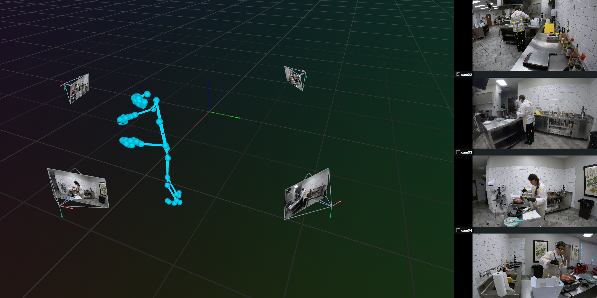

# Exo-Only 3D Human skeleton Reconstruction

Reconstructs a 3D skeleton from **4 GoPro exo cameras only** using multi-view triangulation — no ego (Aria) camera needed.



---

## How It Works

```
4 GoPro frames (cam01–cam04)
        │
        ▼
RTMPose Wholebody       
  (body + hands + face)     
        │
        ▼
DLT Triangulation        
  (across all 4 views)      
        │
        ▼
Rerun Visualization      →   3D skeleton + live camera feeds
```

**Triangulation method:** Direct Linear Transform (DLT)  
Each 3D joint is solved from all cameras that see it (confidence ≥ 0.3) by finding the least-squares solution to the system of projection equations via SVD.

---

## Dependencies

```bash
pip install rtmlib rerun-sdk opencv-python numpy
```

| Library | Role |
|---|---|
| [rtmlib](https://github.com/Tau-J/rtmlib) | RTM lib for inference
| [RTMPose](../third_party/RTMPose) | Wholebody 2D pose model  |
| rerun-sdk | 3D visualization |
| opencv-python | Frame I/O |

---

## Usage

```bash
# Default: indiana_cooking_21_4, frames 250–309
python src/main.py

# Custom take, frame range, output
python src/main.py \
  --take /path/to/egoexo4d/takes/your_take \
  --start 0 \
  --frames 100 \
  --out output/my_scene.rrd

# Open result in Rerun
rerun output/exo_scene.rrd
```

---

## Input Data Layout

```
take_dir/
├── frames_from_videos/
│   ├── cam01/   frame_0001.png ...
│   ├── cam02/   frame_0001.png ...
│   ├── cam03/   frame_0001.png ...
│   └── cam04/   frame_0001.png ...
└── trajectory/
    └── gopro_calibs.csv        ← intrinsics + extrinsics for all 4 GoPros
```

---

## Output (Rerun Viewer)

| Panel | Content |
|---|---|
| **3D Scene** |  body + hand + face skeleton in world coordinates |
| **Camera feeds** | Live GoPro frames with 2D skeleton overlay |

---

